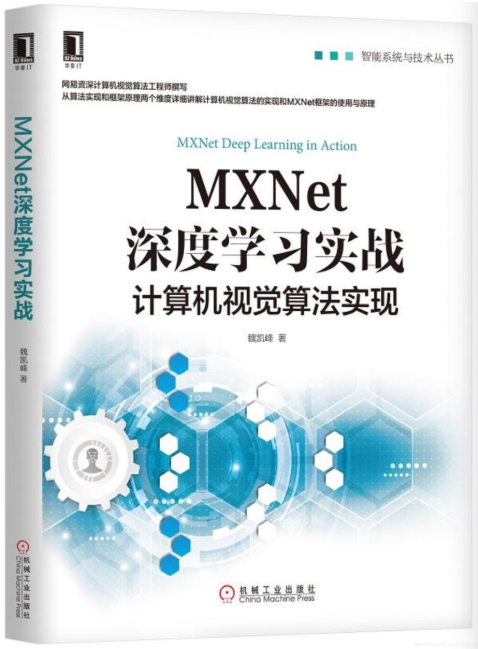

#### 这个项目是《MXNet深度学习实战》书籍的代码，2019年6月出版，目前可以从京东、天猫、淘宝、当当等平台购买。

#### 前言
一直以来都希望将自己对算法的理解整理成笔记，和他人分享、切磋，2年前写博客是一个起点，1年前写这本书又是一个起点。

这本书侧重对算法基础和框架应用的介绍，同时包含丰富的实战代码帮助读者实现算法，关于这本书的详细内容可以参考[这篇博客](https://blog.csdn.net/u014380165/article/details/84556738)。读者在阅读这本书时遇到任何问题都可以在此项目的issue中留言，希望这本书能成为更多前行在AI之路上的同道之人的好伙伴，加油！

#### 本书代码环境
* Ubuntu 16.04
* CUDA 8.0
* cuDNN 7.0.3
* MXNet 1.3.1
* Python 3.5

#### 本书目录
* 第1章 全面认识MXNet
* 第2章 搭建开发环境
* 第3章 MXNet基础
* 第4章 MNIST手写数字体分类
* 第5章 数据读取及增强
* 第6章 网络结构搭建
* 第7章 模型训练配置
* 第8章 图像分类
* 第9章 目标检测
* 第10章 图像分割
* 第11章 Gluon
* 第12章 GluonCV

#### 本书部分代码及内容参考了如下资料，特此注明：
* MXNet官方源码：[MXNet](https://github.com/apache/incubator-mxnet)。
* MXNet官方关于SSD算法的实现：[SSD](https://github.com/apache/incubator-mxnet/tree/master/example/ssd)。
* MXNet官方关于FCN算法的实现：[FCN](//github.com/apache/incubator-mxnet/tree/master/example/fcn-xs)。
* Gluon快速上手教程：[Gluon](https://beta.mxnet.io/guide/crash-course/index.html)。
* GluonCV库，一个非常棒的复现计算机视觉前沿算法的工具库：[GluonCV](https://gluon-cv.mxnet.io/)。
* 《动手学深度学习》，中文书籍，讲解过程深入浅出，非常值得读者学习：[书籍地址](https://zh.gluon.ai/)。